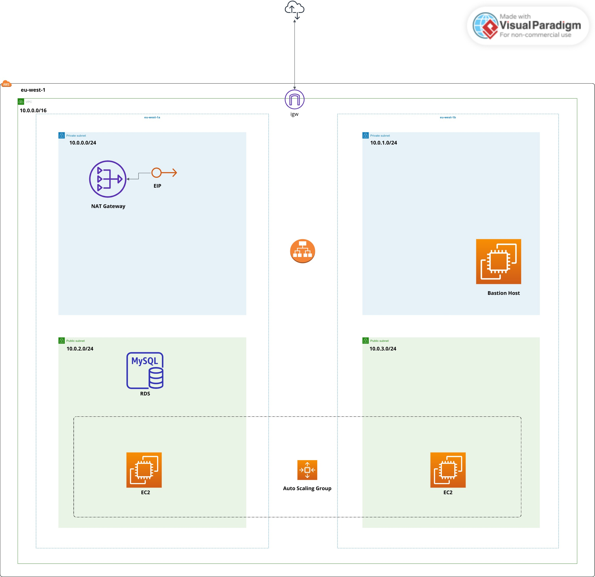

# Web Application Architecture

This project establishes a resilient AWS environment featuring an auto-scaling EC2 configuration supported by a load balancer and an RDS instance. The architecture prioritizes secure communication between these components.

## Project Highlights

* **Architecture** : Leverage Terraform and Terragrunt to craft an adaptive AWS setup. This includes an auto-scaling EC2 arrangement complemented by a load balancer and an RDS instance, ensuring both scalability and security.
* **Modularity** : The project is structured into two pivotal modules — the Network Module and the Auto Scaling Group Module. This separation streamlines development and management.
* **Terragrunt Benefits** : The integration of Terragrunt simplifies module deployment and administration, enabling enhanced reusability and configuration control.

## Project Structure

The project structure is as folows:

```bash
├── dev
│   ├── auto_sg
│   │   └── terragrunt.hcl
│   ├── common.hcl
│   ├── db.tfvars
│   ├── network
│   │   └── terragrunt.hcl
│   └── terragrunt.hcl
├── modules
│   ├── auto_sg
│   │   ├── alb.tf
│   │   ├── bastion.tf
│   │   ├── cloudwatch_alarm.tf
│   │   ├── db.tf
│   │   ├── keys.tf
│   │   ├── launch_template.tf
│   │   ├── scaling_group.tf
│   │   ├── scaling_policy.tf
│   │   ├── userdata
│   │   │   ├── bastion.sh
│   │   │   └── httpd.sh
│   │   └── variables.tf
│   └── network
│       ├── igw.tf
│       ├── nat.tf
│       ├── output.tf
│       ├── routes.tf
│       ├── securitygroups.tf
│       ├── subnets.tf
│       ├── variables.tf
│       └── vpc.tf
├── .gitignore
└── README.md

```

# Architecture



The main components of the project are as follows:

1. **Network Module** :
   Located within the `modules/network` directory, this module establishes the foundational networking components. It encompasses the creation of a Virtual Private Cloud (VPC), the configuration of subnets, the integration of an Internet Gateway (IGW) for external connectivity, and the setup of a Network Address Translation (NAT) Gateway for private subnet access to the internet.
2. **Auto Scaling Group Module** :
   Found in the `modules/auto_sg` directory, this module orchestrates the auto-scaling EC2 instances with a launch template, load balancers, a bastion host if enabled, cloudwatch alarms and scaling policies, and an RDS database. It ensures the environment's elasticity by dynamically adjusting the number of instances based on traffic. The module's components collaborate seamlessly to provide high availability, responsive user experiences, and scalability.
3. **Terragrunt Integration** :
   Terragrunt empowers the efficient deployment of modules by encapsulating configurations. Utilized within the `dev` directory, it simplifies and enhances the process by managing environment-specific settings and enabling consistent deployment practices. Terragrunt provides an abstraction layer that streamlines module usage and maintenance.

# Getting Started

To deploy the architecture using Terragrunt:

1. Clone the repository to your local environment.
2. Navigate to the dev directory.
3. Adjust environment-specific variables in **.hcl** and **.tfvars** files. Set a .tfvars file in the root of **dev** dir to handle the rds credetional variables.
4. Apply the configurations using Terragrunt:

```
terragrunt run-all apply
```
